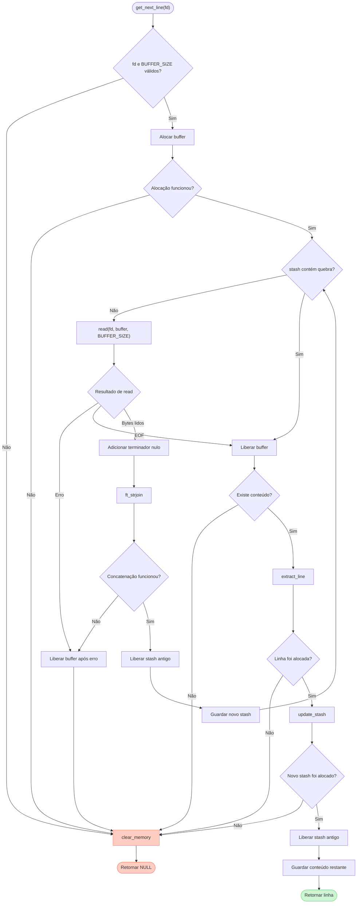

*This project has been created as part of the 42 curriculum by inaomi-i.*

# Get Next Line

## Descrição

O `get_next_line` é uma função que lê e retorna uma linha de um descritor de arquivo.

Chamadas repetidas à função permitem ler um arquivo linha por linha. A função também pode ser utilizada para ler da entrada padrão.

O projeto tem como objetivo praticar conceitos como:

* descritores de arquivo;
* leitura com `read`;
* variáveis estáticas;
* alocação dinâmica de memória;
* manipulação de strings.

### Função

```c
char	*get_next_line(int fd);
```

#### Parâmetro

* `fd`: descritor de arquivo que será lido.

#### Retorno

* linha lida;
* `NULL` quando não há mais conteúdo ou quando ocorre um erro.

A linha retornada inclui o caractere `\n`, exceto quando o arquivo termina sem uma quebra de linha.

## Algoritmo e estruturas de dados

### Algoritmo

* valida o descritor de arquivo e o valor de `BUFFER_SIZE`;
* lê até encontrar `\n` ou chegar ao fim do arquivo;
* junta os bytes lidos ao conteúdo armazenado em `stash`;
* separa a primeira linha;
* guarda o conteúdo restante para a próxima chamada;
* libera as memórias que não são mais necessárias;
* retorna a linha encontrada.

### Estruturas de dados

O projeto utiliza uma variável estática chamada `stash`:

```c
static char	*stash;
```

Ela mantém entre as chamadas o conteúdo que foi lido, mas ainda não foi retornado.

Essa estrutura foi escolhida porque uma chamada a `read` pode trazer uma linha completa e parte da linha seguinte. Sem uma variável estática, esse conteúdo restante seria perdido quando `get_next_line` terminasse.

O buffer é utilizado apenas durante a leitura. A linha encontrada é criada em uma nova alocação e o restante é salvo em um novo `stash`.

### Diagrama



## Instruções

### Compilação

Compile utilizando as flags obrigatórias e defina o tamanho do buffer:

```bash
cc -Wall -Wextra -Werror -D BUFFER_SIZE=42 \
	get_next_line.c get_next_line_utils.c main.c -o gnl_test
```

Também é possível compilar sem a flag `-D BUFFER_SIZE`. Nesse caso, será utilizado o valor padrão definido em `get_next_line.h`.

```bash
cc -Wall -Wextra -Werror \
	get_next_line.c get_next_line_utils.c main.c -o gnl_test
```

### Como utilizar

Crie um arquivo `main.c`:

```c
#include "get_next_line.h"
#include <fcntl.h>
#include <stdio.h>

int	main(void)
{
	char	*line;
	int		fd;

	fd = open("arquivo.txt", O_RDONLY);
	if (fd < 0)
		return (1);
	line = get_next_line(fd);
	while (line)
	{
		printf("%s", line);
		free(line);
		line = get_next_line(fd);
	}
	close(fd);
	return (0);
}
```

Execute:

```bash
./gnl_test
```

## Recursos
* [Linux Manual Pages](https://man7.org/linux/man-pages/);
* [cppreference - linguagem C](https://en.cppreference.com/w/c.html);
* [DevDocs - C](https://devdocs.io/c/).

### Uso de inteligência artificial

A inteligência artificial foi utilizada como ferramenta de apoio para:

* criação do diagrama de fluxo;
* revisão da documentação;
* identificação de casos para testes.

A implementação das funções da biblioteca foi realizada pela autora do projeto.
